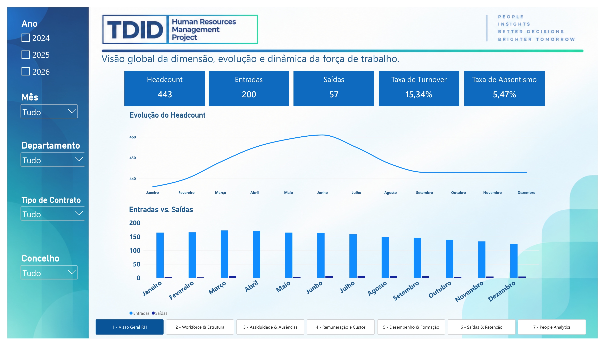
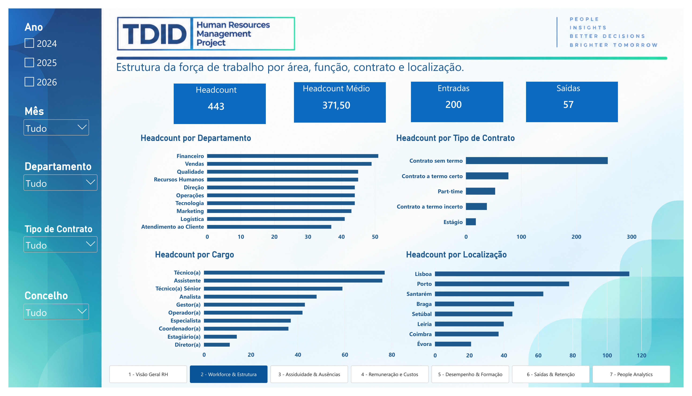
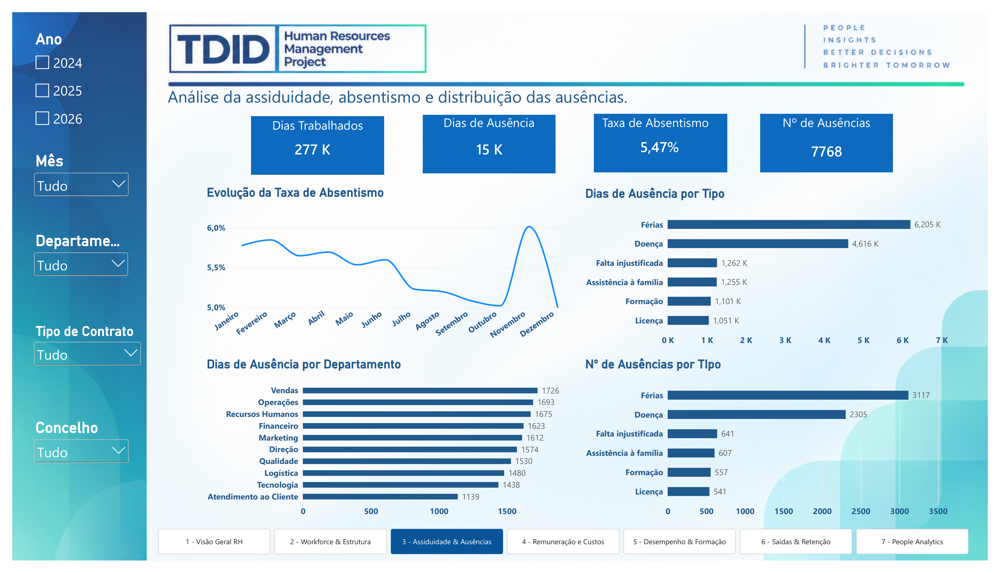
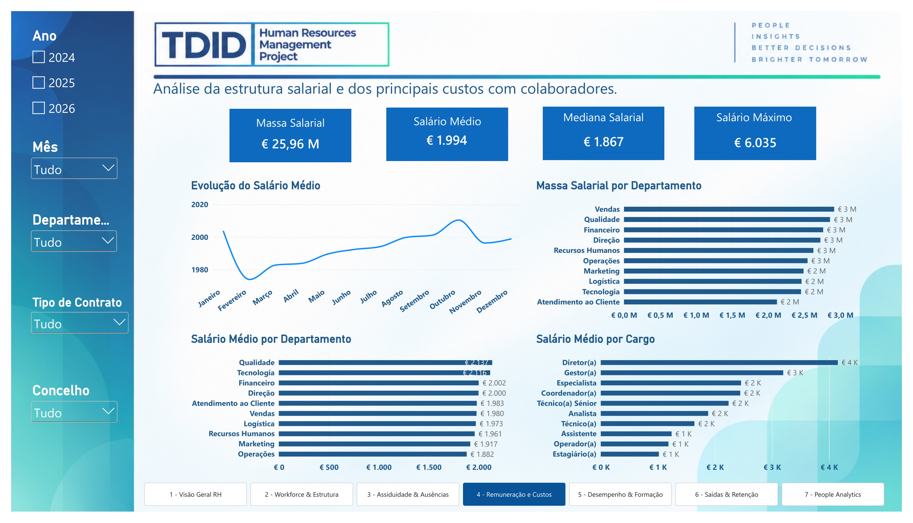
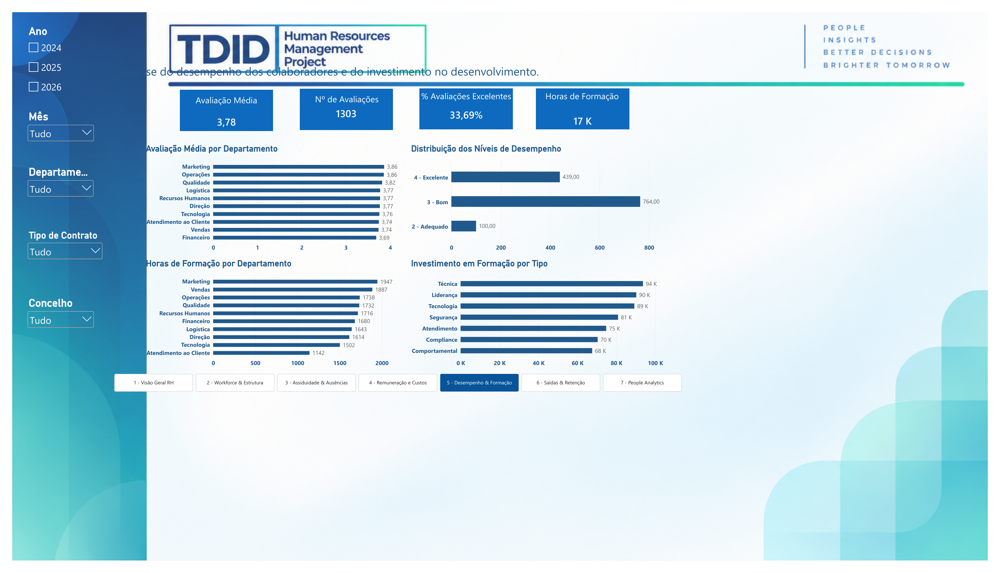
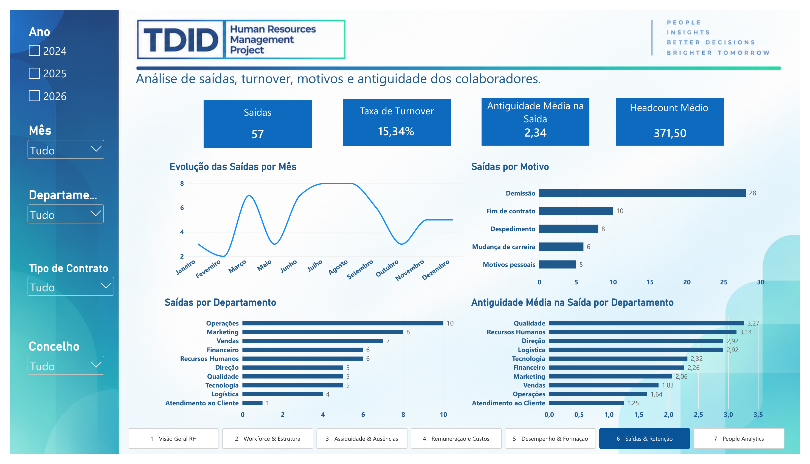
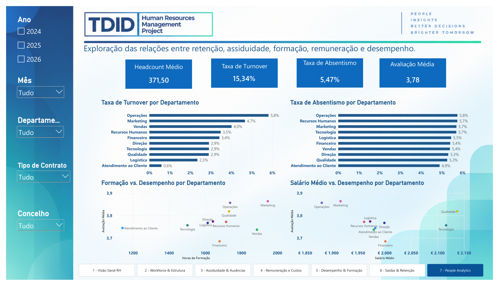

# TDID — HR People Analytics


> **Transforming HR data into insights for better people decisions.**

---

## 📌 Project Overview

**TDID — HR People Analytics** is a portfolio project developed to demonstrate how data can be transformed into actionable information for Human Resources management.

The project uses a **synthetic HR database** and a dimensional data model to build an interactive Power BI dashboard covering workforce structure, attendance, absences, remuneration, performance, training, employee exits and strategic People Analytics indicators.

The objective is not simply to present HR metrics, but to demonstrate a complete analytical workflow:

**Raw Data → Data Transformation → Data Model → DAX Measures → Analysis → Business Insights**

---

## 🎯 Business Problem

Human Resources departments manage large amounts of information across different areas:

- employee records;
- contracts and departments;
- salaries;
- attendance and absences;
- performance evaluations;
- training;
- employee exits.

When these data sources are analysed separately, it becomes difficult to obtain a consistent view of the workforce.

This project addresses that challenge by bringing the information together in a structured analytical model and providing a single environment for exploring key HR indicators.

---

## 💡 Project Objectives

The dashboard was designed to answer questions such as:

- How is the workforce evolving?
- How many employees are currently active?
- How many employees enter and leave the organisation?
- What is the turnover rate?
- Which departments have higher absence levels?
- How is remuneration distributed across departments and roles?
- How is employee performance distributed?
- How much is being invested in employee training?
- What are the main reasons for employee exits?
- Are there observable relationships between training, remuneration, performance and retention?

---

## 🗂️ Data Model

The project follows a **dimensional / star-schema approach**, separating descriptive dimensions from transactional fact tables.

### Main dimensions

- `dColaborador`
- `dDepartamento`
- `dCargo`
- `dTipoContrato`
- `dLocalizacao`
- `dMotivoSaida`
- `dTipoAusencia`
- `dTipoFormacao`
- `dCalendario`

### Main fact tables

- `fRemuneracao`
- `fAssiduidade`
- `fAusencias`
- `fDesempenho`
- `fFormacao`
- `fSaidas`

This structure makes it possible to create reusable measures and analyse the same business entities from different perspectives.

---

## 📊 Dashboard

The Power BI report contains **7 analytical pages**, each focused on a different aspect of workforce management.

### 01 — Visão Geral RH

> Visão global da dimensão, evolução e dinâmica da força de trabalho.

Key indicators:

- Headcount
- Entradas
- Saídas
- Taxa de Turnover
- Taxa de Absentismo
- Evolução do Headcount



---

### 02 — Workforce & Estrutura

> Estrutura da força de trabalho por área, função, contrato e localização.

The page explores:

- Headcount por Departamento
- Headcount por Tipo de Contrato
- Headcount por Cargo
- Headcount por Localização
- Headcount Médio
- Entradas e Saídas



---

### 03 — Assiduidade & Ausências

> Análise da assiduidade, absentismo e distribuição das ausências.

The analysis includes:

- Dias Trabalhados
- Dias de Ausência
- Taxa de Absentismo
- Nº de Ausências
- Evolução do absentismo
- Ausências por tipo
- Ausências por departamento



---

### 04 — Remuneração & Custos

> Análise da estrutura salarial e dos principais custos com colaboradores.

Key indicators and analyses:

- Massa Salarial
- Salário Médio
- Mediana Salarial
- Salário Máximo
- Massa Salarial por Departamento
- Salário Médio por Departamento
- Salário Médio por Cargo
- Evolução do Salário Médio



---

### 05 — Desempenho & Formação

> Análise do desempenho dos colaboradores e do investimento no desenvolvimento.

The page combines:

- Avaliação Média
- Nº de Avaliações
- Avaliações Excelentes
- Horas de Formação
- Avaliação por Departamento
- Distribuição dos níveis de desempenho
- Horas de Formação por Departamento
- Investimento em Formação por Tipo



> Performance data in the synthetic dataset is available at annual granularity. The analysis therefore avoids creating artificial monthly performance trends.

---

### 06 — Saídas & Retenção

> Análise das saídas, turnover, motivos e antiguidade dos colaboradores.

Key analyses:

- Saídas
- Taxa de Turnover
- Antiguidade Média na Saída
- Headcount Médio
- Evolução das Saídas
- Saídas por Motivo
- Saídas por Departamento
- Antiguidade Média na Saída por Departamento



---

### 07 — People Analytics

> Exploração das relações entre retenção, assiduidade, formação, remuneração e desempenho.

This page moves beyond descriptive reporting and explores relationships between HR indicators through:

- Taxa de Turnover por Departamento
- Taxa de Absentismo por Departamento
- Formação vs Desempenho
- Salário Médio vs Desempenho



> Scatter plots are used to explore associations between variables. They should not be interpreted as evidence of causality.

---

## 📈 Key KPIs

| Area | KPI |
|---|---|
| Workforce | Headcount |
| Workforce | Entradas |
| Workforce | Saídas |
| Retention | Taxa de Turnover |
| Attendance | Taxa de Absentismo |
| Attendance | Dias de Ausência |
| Compensation | Massa Salarial |
| Compensation | Salário Médio |
| Compensation | Mediana Salarial |
| Performance | Avaliação Média |
| Performance | Nº de Avaliações |
| Training | Horas de Formação |
| Training | Investimento em Formação |
| Retention | Antiguidade Média na Saída |

---

## 🔍 Analytical Approach

The project follows a structured data analytics workflow.

### 1. Data Preparation

Data was prepared using **Power Query**, including:

- data type correction;
- column standardisation;
- transformation of dates;
- preparation of dimension and fact tables;
- validation of numerical fields;
- creation of the calendar dimension.

### 2. Data Modelling

A dimensional model was created using:

- fact tables;
- dimension tables;
- one-to-many relationships;
- a dedicated calendar table;
- reusable analytical dimensions.

### 3. DAX

DAX measures were created for:

- headcount;
- admissions;
- exits;
- turnover;
- absenteeism;
- remuneration;
- performance;
- training;
- retention.

The model also uses filter-context techniques to ensure that KPIs respond correctly to slicers and department-level analysis.

### 4. Dashboard Design

The report was designed around:

- consistent navigation;
- synchronized filters;
- KPI cards;
- trend analysis;
- departmental comparisons;
- analytical tooltips;
- reusable visual patterns.

---

## 🛠️ Tools & Technologies

### Data & ETL
- Microsoft Excel
- Power Query

### Data Visualisation
- Microsoft Power BI

### Analytics
- DAX
- Dimensional Data Modelling
- People Analytics

### Development Approach
- Synthetic data generation
- Business-oriented KPI design
- Interactive dashboard development
- Analytical storytelling

---

## 📂 Project Files

- [Power BI Dashboard PDF](documentation/TDID_HR_People_Analytics_Dashboard.pdf)
- [Project Documentation](documentation/TDID_HR_People_Analytics_Documentation.docx)
- [Synthetic HR Dataset](data/TDID_HR_Gestao_Recursos_Humanos.xlsx)
- [Dashboard folder](dashboard/)
- [Screenshots](images/)

> The `.pbix` file should be added to `dashboard/` once available.

---

## 📦 Data & Scope

The dataset used in this project is **100% synthetic** and was created specifically for portfolio and demonstration purposes.

It represents a fictional organisation with:

- approximately 500 employees;
- multiple departments;
- different job roles;
- different contract types;
- remuneration records;
- attendance and absence records;
- performance evaluations;
- training records;
- employee exit records.

No real employee or company data is used.

---

## ⚠️ Limitations

The project is designed as a portfolio demonstration and therefore has several limitations.

- The dataset is synthetic.
- Performance evaluations are available at annual level.
- Some HR indicators are descriptive rather than predictive.
- Relationships shown in analytical visuals represent associations, not causal effects.
- The current dashboard does not use live HR system data.

These limitations are intentional and provide opportunities for future development.

---

## 🚀 Future Development

The project can be extended into a broader People Analytics solution.

Potential next steps include:

### Predictive Analytics

- Employee turnover prediction
- Absenteeism prediction
- Employee attrition risk modelling

### Advanced Statistical Analysis

- Statistical testing of HR differences
- Correlation and regression analysis
- Identification of potential drivers of turnover and absenteeism

### Machine Learning

- Classification models for employee attrition
- Explainable AI using SHAP
- Employee segmentation
- Workforce forecasting

### Workforce Planning

- Headcount forecasting
- Recruitment needs
- Workforce capacity analysis
- Scenario modelling

### Data Integration

Future versions could connect Power BI directly to:

- HR information systems;
- payroll systems;
- attendance platforms;
- training platforms;
- cloud databases;
- APIs.

---

## 🧠 Portfolio Positioning

This project demonstrates more than dashboard development.

It combines **business understanding, data preparation, modelling, analytics and visual communication**.

It demonstrates practical experience with:

**Business Problem → Data → Model → DAX → Analysis → Decision Support**

The project is particularly relevant to roles involving:

- Data Analysis
- Business Intelligence
- People Analytics
- HR Analytics
- Data Science
- Reporting & Performance Management

---

## 📁 Repository Structure

```text
TDID-HR-People-Analytics/
│
├── README.md
│
├── dashboard/
│   └── TDID_HR_People_Analytics.pbix
│
├── data/
│   └── README.md
│
├── images/
│   ├── 01-visao-geral.png
│   ├── 02-workforce-estrutura.png
│   ├── 03-assiduidade-ausencias.png
│   ├── 04-remuneracao-custos.png
│   ├── 05-desempenho-formacao.png
│   ├── 06-saidas-retencao.png
│   └── 07-people-analytics.png
│
└── documentation/
    └── TDID_HR_People_Analytics_Documentation.docx
```

---

## 👤 About TDID

**TDID — Turning Data Into Decisions**

The project is part of a portfolio focused on transforming business data into clear information, analytical insights and decision-support tools.

> **People Insights. Better Decisions. Brighter Tomorrow.**

---

## 📌 Project Status

**Completed — Portfolio Version**

The current version includes:

- [x] Synthetic HR dataset
- [x] Data preparation
- [x] Dimensional data model
- [x] DAX measures
- [x] 7-page Power BI dashboard
- [x] Synchronized filters
- [x] Analytical tooltips
- [x] People Analytics analysis
- [x] Portfolio documentation

Future versions may expand the project into predictive People Analytics and Machine Learning.
